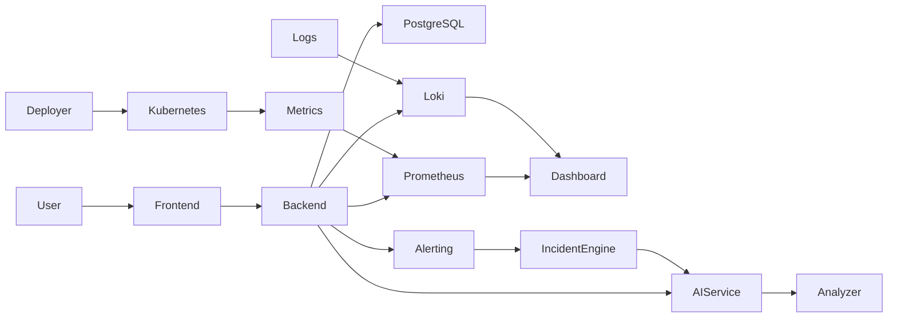
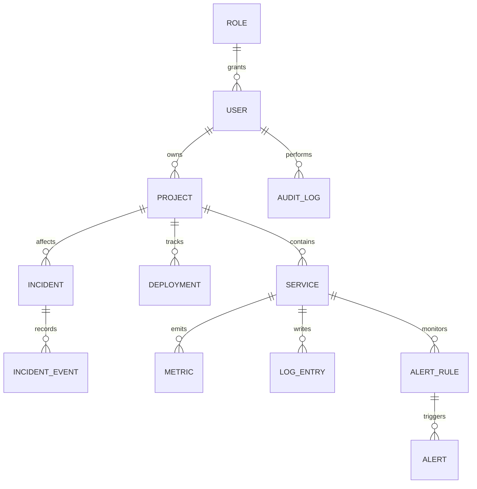
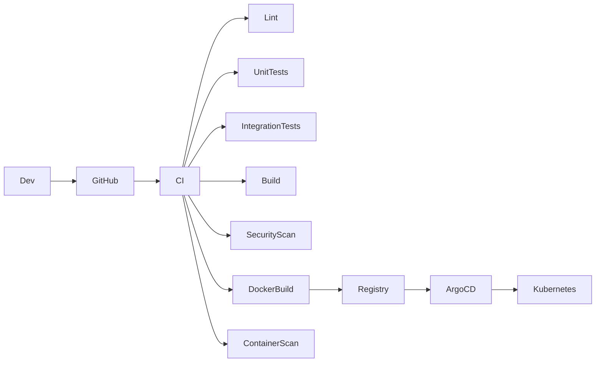

# DevPulse architecture

## 1. Vision

DevPulse is an AI-powered DevOps observability platform intended for engineering teams that need to monitor application health, detect incidents quickly, correlate changes with deployment history, and reduce time-to-diagnosis.

The product is designed around a single principle: operational intelligence should be actionable. A team should not only see metrics and logs, but also understand what likely failed, why it failed, and which remediation steps are most relevant.

## 2. High-level architecture



## 3. System responsibilities

### Frontend
The frontend is an Angular application built for a professional operational interface. It centralizes:

- authentication and authorization flows
- dashboard widgets and KPI cards
- operational data tables and filters
- incidents and deployment timelines
- AI-generated recommendations
- chaos simulation actions gated by RBAC

### Backend
The backend is the operational core of the platform. It manages application domain data, user access, API contracts, project metadata, metrics ingestion, deployment history and incident lifecycle. It is also responsible for validation, pagination, error handling, security and audit logging.

### AI service
The AI service is a separate FastAPI component specialized in:

- anomaly detection
- incident classification
- root-cause hypotheses
- metric/log correlation
- recommendation generation
- summary generation for operational incidents

It is designed to work with deterministic rules and statistical checks before optional LLM enrichment when an API key is configured.

### Observability stack
Prometheus and Loki collect operational signals from the runtime environment. Grafana provides dashboards for teams to inspect system health and incident evolution.

## 4. Repository architecture

```text
devpulse/
├── frontend/            # Angular front-end
├── backend/             # Spring Boot API
├── ai-service/          # FastAPI analysis service
├── infrastructure/      # Docker/Kubernetes/ArgoCD manifests
├── monitoring/          # Prometheus, Grafana, Loki configs
├── docs/                # Architecture, security, interviews, API docs
├── scripts/             # developer scripts and automation
├── tests/               # end-to-end and integration test folders
├── .github/workflows/   # CI/CD workflows
├── docker-compose.yml   # local dev environment
├── .env.example         # env template
├── README.md            # project overview
├── CONTRIBUTING.md      # contributor guidelines
├── CHANGELOG.md         # release history
└── .gitignore
```

## 5. Domain model

### Core entities

- User
- Role
- Project
- Environment
- Service
- Metric
- LogEntry
- Incident
- IncidentEvent
- AlertRule
- Alert
- Deployment
- AuditLog

### Relationships



## 6. API plan

The backend exposes logical domains under a REST API design.

- /auth: login, register, refresh-token, logout
- /users: user management and profile operations
- /projects: CRUD for project metadata and ownership
- /services: service inventory and health status
- /metrics: query and aggregate telemetries
- /logs: search, filter and pagination for logs
- /incidents: incident creation, updates and resolution
- /alerts: alert rules and alert events
- /deployments: deployment history and statuses
- /chaos: safe simulation endpoint with RBAC guardrails
- /ai: incident analysis, summaries and recommendations

## 7. Security architecture

The application must treat security as a first-class concern.

- JWT access tokens and refresh tokens
- password hashing using BCrypt or PBKDF2
- RBAC with ADMIN / DEVELOPER / VIEWER roles
- Spring Security method security on protected endpoints
- strict CORS configuration for allowed origins
- request validation with Bean Validation
- audit logs for sensitive operations
- secret management via environment variables and Kubernetes secrets
- no raw secrets committed to source control

## 8. Kubernetes plan

The deployment architecture uses a namespace-scoped product layout with separate workloads for each service.

### Proposed structure

```text
infrastructure/kubernetes/
├── namespace.yaml
├── configmaps/
├── secrets/
├── frontend/
├── backend/
├── ai-service/
├── postgres/
├── prometheus/
├── grafana/
├── loki/
├── ingress/
└── networkpolicy/
```

### Workloads
- frontend Deployment + Service + Ingress
- backend Deployment + Service + Health probes
- ai-service Deployment + Service + readiness/liveness
- PostgreSQL StatefulSet or Deployment with PersistentVolume
- Prometheus Deployment with config via ConfigMap
- Grafana Deployment with datasource configuration
- Loki Deployment with persistent storage

### Policies
- resource requests and limits
- liveness and readiness probes
- rolling update strategy
- ingress TLS termination with optional cert-manager
- secrets stored as Kubernetes Secrets
- non-production simulation actions disabled by default

## 9. CI/CD plan

The CI/CD flow is designed to fail early when quality or security gates are violated.



### Pipeline stages
1. lint
2. unit tests
3. integration tests
4. backend + frontend build
5. security scan
6. Docker image build
7. vulnerability scanning (Trivy)
8. image push to registry
9. deployment via ArgoCD
10. health verification

## 10. GitOps strategy

ArgoCD provides GitOps-based deployment automation.

- source of truth is Git
- app manifests live in infrastructure folders
- auto-sync enabled for controlled environments
- self-heal for drift correction
- prune enabled to remove deleted resources
- rollback via Git revert or ArgoCD previous revision

## 11. AI analysis model

The AI analysis pipeline is intentionally resilient and practical.

### Execution pattern
1. collect metrics, logs and errors
2. normalize event data
3. apply deterministic threshold rules immediately or across a configured metric-time window
4. resolve active alerts when a new sample returns to a healthy value
5. enqueue `alert.opened` / `alert.resolved` webhook notifications when configured
6. compute statistical anomaly scores
7. correlate with deployment timeline
8. classify incident severity
9. generate recommendations
8. optionally enrich with an external LLM when credentials exist

### Fallback strategy
The system must keep working without external AI APIs. Deterministic heuristics and rule-based analysis remain the primary engine.

Timed alert rules evaluate the persisted samples in the event-time window ending
at the latest ingested point. Every observed sample in the window and a
breaching sample at or before its start must satisfy the rule. No missing
samples are inferred. Alerts are deduplicated while an alert for the rule is
already open; automatic resolution is not implemented.

## 12. Risks and mitigations

### Risk: over-engineering the product too early
Mitigation: implement domain-driven modules, keep interfaces stable, avoid premature microservice splitting.

### Risk: insecure secrets management
Mitigation: environment templates only, Kubernetes Secrets, no committed credentials.

### Risk: poor observability data quality
Mitigation: use strict schemas and validation for metrics, logs and alert rules.

### Risk: weak user separation
Mitigation: enforce RBAC at endpoint and service layers with explicit authorization checks.

### Risk: fragile AI behavior
Mitigation: keep deterministic logic as the default path and never require external APIs for core system operations.

## 13. Validation criteria

The project is considered viable when the following conditions are true:

- backend APIs compile and run with tests
- frontend renders core screens without broken routes
- authentication and role checks work end-to-end
- incident detection can be triggered from sample data
- AI analysis returns structured recommendations
- Docker compose runs locally
- Kubernetes manifests are valid and deployable in a cluster
- security scans do not reveal critical issues
- docs match actual implementation

## 14. Roadmap

### Milestone 1 — repository foundation
- initialize monorepo structure
- set contribution standards
- prepare environment templates
- define architecture documentation

### Milestone 2 — backend core
- Spring Boot application skeleton
- PostgreSQL and Flyway
- domain entities and repositories
- DTOs and mappers
- validation and exception handling

### Milestone 3 — authentication and RBAC
- registration/login
- JWT and refresh tokens
- authorization rules
- protected endpoints and tests

### Milestone 4 — frontend foundation
- Angular app shell
- authentication pages
- dashboard and navigation
- key tables and charts

### Milestone 5 — monitoring and AI
- Prometheus/Grafana/Loki integration
- anomaly detection and incident recommendation engine
- alerting and deployment correlation logic

### Milestone 6 — Docker and Compose
- containerization
- local orchestration
- demo mode seed data

### Milestone 7 — Kubernetes and GitOps
- manifests and health checks
- ArgoCD deployment workflow
- self-heal and rollback process

### Milestone 8 — final hardening
- security review
- E2E tests
- docs and portfolio assets

## 15. Decision rationale

The chosen stack is intentionally pragmatic and professional:

- Angular for a modern operational dashboard
- Spring Boot for robust backend APIs and strong enterprise standards
- PostgreSQL for relational data integrity and auditability
- Python FastAPI for analytics and AI orchestration
- Prometheus, Grafana, Loki for observability signals
- Kubernetes and ArgoCD for real-world production deployment patterns

This combination keeps the product realistic, testable and demonstrable while staying aligned with the requirements of an open-source portfolio project.

## 16. État réel du backend (mis à jour au fil du développement)

Cette section reflète ce qui est **réellement implémenté et testé** dans `backend/`, pas ce qui est prévu — voir RÈGLE 1/2 du projet.

### Fait et testé
- Entités JPA pour l'authentification, projets, membres, clés d'ingestion, refresh tokens, audit logs et ressources d'observabilité, avec migrations Flyway V1–V9.
- Authentification JWT bout-en-bout : `POST /api/auth/register`, `/login`, `/refresh`, `/logout` (voir `AuthController`, `AuthService`, `JwtService`).
- Les refresh tokens sont rotatifs et à usage unique ; leur empreinte est stockée en base. Le rejeu révoque la famille de session ; la déconnexion révoque les refresh tokens de la famille.
- Journaux d'audit paginés pour connexions, rotation/réutilisation/déconnexion, membres de projet et clés d'ingestion. Les secrets ne sont pas enregistrés.
- L'accès aux journaux d'un projet est réservé au propriétaire et aux ADMIN globaux ; la liste globale est réservée aux ADMIN.
- Les clés d'ingestion sont limitées aux routes d'ingestion de métriques et de logs pour leur projet.
- Les membres de projet ont des rôles DEVELOPER/VIEWER et un contrôle d'accès projet centralisé.
- Filtre `JwtAuthenticationFilter` + `CustomUserDetailsService` : les endpoints protégés vérifient réellement le token à chaque requête (pas seulement à la connexion).
- RBAC fonctionnel : `POST /api/projects` exige `ADMIN` ou `DEVELOPER` via `@PreAuthorize`, testé par `AuthFlowIntegrationTest`.
- `RoleSeeder` : garantit que les rôles ADMIN/DEVELOPER/VIEWER existent au démarrage, que Flyway soit activé ou non (utile en local où Flyway est désactivé par défaut).
- Gestion d'erreurs centralisée via `GlobalExceptionHandler` + `ApiException` (au lieu de `RuntimeException` génériques).
- Tests : tests backend unitaires et d'intégration incluant `AuditLogIntegrationTest` et `AuthFlowIntegrationTest`. La suite a été vérifiée avec H2 et PostgreSQL 15/Flyway.

### Limitations connues (volontairement non cachées)
- **Révocation des refresh tokens uniquement** : chaque refresh token est à usage unique et stocké sous forme d'empreinte ; une réutilisation révoque la famille de session. La déconnexion révoque cette famille lorsqu'elle reçoit le refresh token. Les access tokens déjà émis restent valides jusqu'à expiration.
- **Consultation des journaux d'audit uniquement par API** : il n'existe pas encore d'écran Angular dédié.
- **Pas d'endpoint `/api/users`** pour la gestion des comptes par un ADMIN (prévu en Phase 2/3 suite, pas encore fait).
- **Register attribue toujours le rôle DEVELOPER** : il n'y a pas encore de mécanisme pour créer un compte ADMIN autrement qu'en modifiant la base manuellement (à faire : un seed `.env`-driven pour le premier admin, ou un endpoint réservé).
- **Flyway désactivé par défaut** en local (`SPRING_FLYWAY_ENABLED=false`, `ddl-auto=update`) : pratique pour itérer vite, mais `V1__init_schema.sql`/`V2__seed_roles.sql` ne sont réellement exercées qu'avec `SPRING_FLYWAY_ENABLED=true` (à valider avant tout déploiement).
### Frontend (Angular) — build réellement vérifié
Comme pour le service AI, `npm install && ng build` a été **réellement exécuté** dans le bac à sable (npm a accès à npmjs.org) : **build de production propre, 1.08 MB, aucune erreur ni warning de budget**.

- Stack réelle : Angular 19 (standalone components, signals), PrimeNG 19 (Aura theme), Reactive Forms, RxJS — conforme à la stack demandée.
- ✅ Auth complète : `AuthService` (login/register/logout, session dans `localStorage`), `authInterceptor` (attache le JWT, déconnecte sur 401), `authGuard` (protège les routes)
- ✅ Layout : sidebar + navigation vers les 7 sections prévues par la spec, responsive (sidebar horizontale en dessous de 768px)
- ✅ Pages réelles branchées sur le backend : Login (formulaire réactif, validation), Dashboard (liste/création de projets via `/api/projects`), Incidents (liste + changement de statut via `/api/incidents`)
- ⚠️ Pages Logs/Metrics/Deployments/Alerts/Settings : **placeholders honnêtes** ("pas encore construit"), pas de fausses données — le backend a déjà les API correspondantes (voir docs/api.md), il manque juste les composants Angular
- ❌ **Aucun test unitaire/composant Angular écrit** (`ng test` non lancé — pas de fichiers `.spec.ts`). C'est un vrai manque par rapport à l'objectif "frontend coverage > 70%".
- ❌ Charts (Chart.js, installé mais pas utilisé), dark mode et breadcrumbs : pas encore faits. Les notifications webhook sortantes sont configurables côté backend ; les notifications in-app ne sont pas encore implémentées.
- Anciens fichiers HTML/JS statiques déplacés dans `frontend/legacy-static-prototype/` (non utilisés par le build Angular, gardés pour référence uniquement)

### AI Service (Python/FastAPI) — build/tests réellement vérifiés
Comme pour le frontend, contrairement au backend Java (jamais compilé/testé dans cet environnement faute d'accès à Maven Central), le service AI Python a été **réellement installé et testé** (pip a accès à PyPI) : `pip install -r requirements.txt -r requirements-dev.txt && pytest` → **16/16 tests passent**.

- `IncidentAnalyzer` : classification par règles déterministes (mots-clés database/memory/latency), confiance croissante avec le nombre de signaux, fallback `GENERAL` si rien ne matche. Ce n'est PAS un placeholder — vraie logique, teste chaque branche.
- `z_score_anomaly` (couche "stats", `POST /api/analysis/anomalies`) : détection d'anomalie par z-score contre un historique, gère les cas limites (historique trop court, variance nulle).
- **Contrat JSON vérifié avec le côté Java** : `IncidentAnalysisResponse.java` désérialise par nom de champ exact (`classification`, `confidence`, `rootCause`, `recommendations`, `signals`) — les modèles Pydantic utilisent `serialization_alias` pour produire exactement ce JSON camelCase, et un test HTTP (`test_api.py`) vérifie les clés exactes de la réponse.
- Couche LLM optionnelle (troisième niveau prévu par la spec) : ❌ pas encore implémentée — le service fonctionne entièrement sans clé API externe, conformément à l'exigence "doit continuer à fonctionner sans API externe".
- ❌ Pas de tests d'intégration Java↔Python réels (le Java appelle `http://localhost:8000`, jamais lancé en même temps que le service Python dans cet environnement) — seul le contrat JSON est vérifié côté Python.
